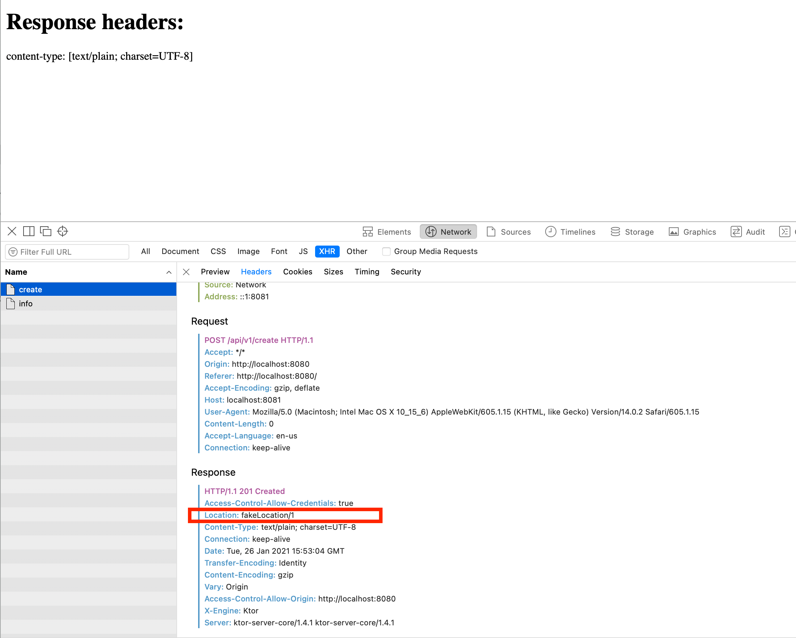
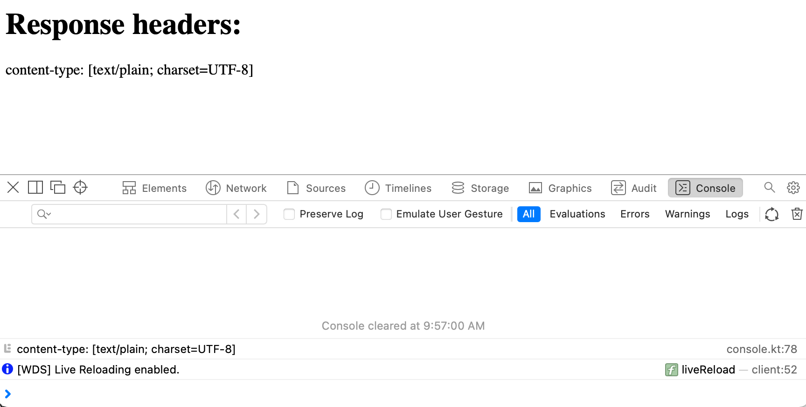

# Reproduction steps

Start server:
```
gradle server:run
```

Check endpoint:
```
curl -v -X POST http://0.0.0.0:8081/api/v1/creat
```

This should print something like the:
```
*   Trying 0.0.0.0...
* TCP_NODELAY set
* Connected to 0.0.0.0 (127.0.0.1) port 8081 (#0)
> POST /api/v1/create HTTP/1.1
> Host: 0.0.0.0:8081
> User-Agent: curl/7.64.1
> Accept: */*
>
< HTTP/1.1 201 Created
< Vary: Origin
< Date: Tue, 26 Jan 2021 15:51:43 GMT
< X-Engine: Ktor
< Server: ktor-server-core/1.4.1 ktor-server-core/1.4.1
< Location: fakeLocation/1
< Content-Length: 1
< Content-Type: text/plain; charset=UTF-8
<
* Connection #0 to host 0.0.0.0 left intact
1* Closing connection 0
```

Note that the response header Location is "fakeLocation/1".

Start web:
```
gradle web:browserDevelopmentRun
```

Browser should open automatically or open `http://localhost:8080`.

Not all headers are shown even though it can be seen that browser does have the response headers:




That means that the code in `App.kt` that uses Ktor to make the request does not have all the response headers:
```
val r = client.post<HttpResponse>("http://localhost:8081/api/v1/create")
r.headers.forEach { key, list ->
    println("$key: $list")
}

setState {
    headers = r.headers
}
```